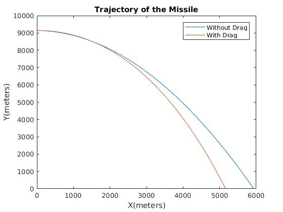
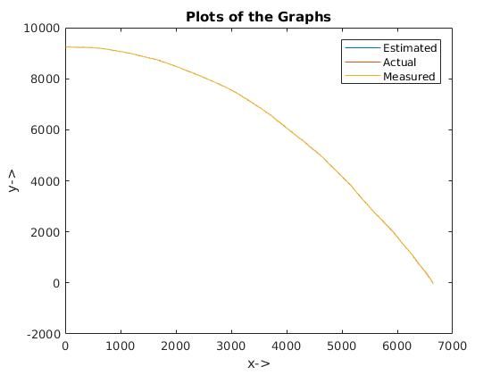
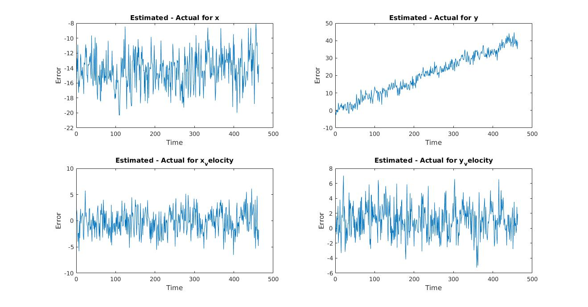
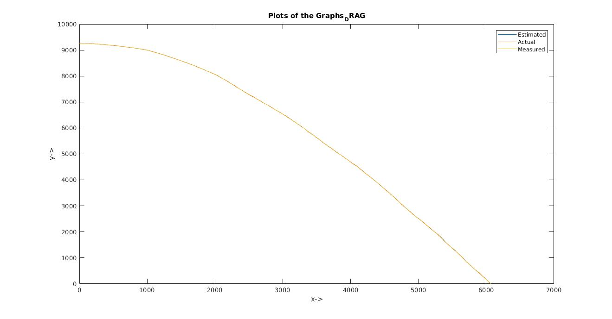
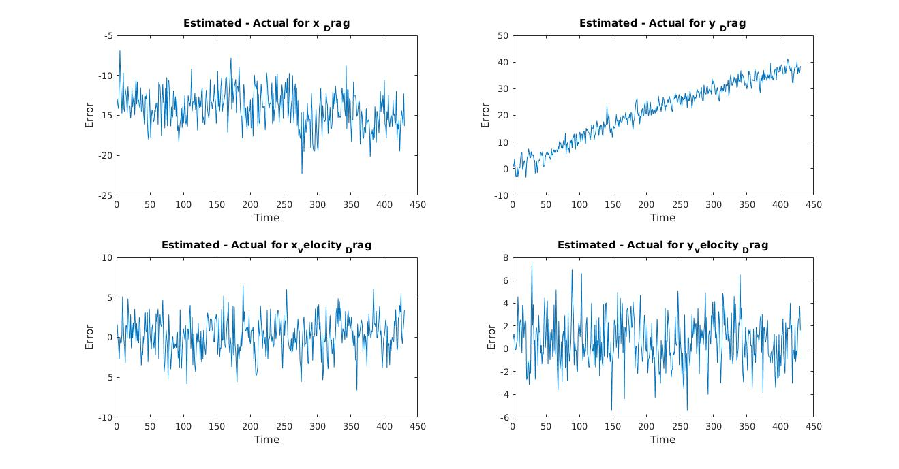

# Kalman Filter Implementation

This project is done for the completion of Quiz 2 of **VI Semester** of Radar Systems. The project is aimed at showing the effectiveness of Kalman Filtering techniques.

## Question
A fighter jet flying at the height of 30,000 feet at the speed of 500 kmph, drops a missile. We need to make a Kalman Filter Estimation of the simulation for

* No drag case
* A drag force being applied on both axes

## Results

This is the simulation result showing the actual trajectories of the missile without any measurement and observation noise

This shows the trajectory without drag but with observation and measurement noise.

These are the various errors without drag

This is the trjectory of the path with drag and noise.

This showcases errors with drag and the Kalman Estimation.